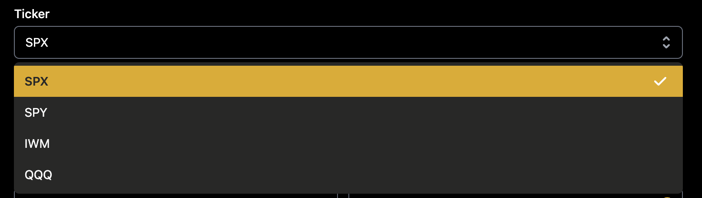
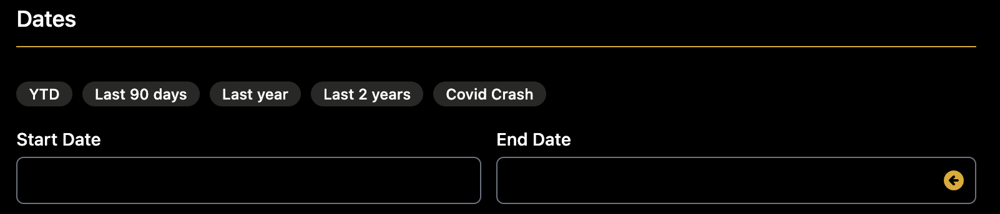

# Getting Started

## Running your first backtest
To create a new backtest, hit the "New Backtest" button on your dashboard

## Tickers
We offer backtesting in SPY, SPX, QQQ, and IWM

## Dates
You can test as far back as 1/1/13 and as most recent as yesterday.

We have some nice little bubbles with popular timeframes that will autopopulate for you

If you notice on the "End Date" field, we have a little arrow. That will populate the last available trading day

## Common Strategies

Under the "Strategy" section, we have a list of common strategies that you can choose from. Below is information about each one.

*Please note, all examples are from The Options Playbook and Tastytrade.*.

- [Butterfly](https://www.optionsplaybook.com/option-strategies/long-call-butterfly-spread/)
- [Calendar](https://www.optionsplaybook.com/option-strategies/calendar-call-spread/)
- [Double Calendar](https://www.tastytrade.com/news-insights/double-calendar-spread-mechanics)
- [Iron Condor](https://www.optionsplaybook.com/option-strategies/iron-condor/)
- [Iron Fly](https://www.optionsplaybook.com/option-strategies/iron-butterfly/)
- [Jade Lizard](https://www.tastytrade.com/concepts-strategies/jade-lizard)
- [Long Call](https://www.optionsplaybook.com/option-strategies/long-call/)
- [Long Call Spread](https://www.optionsplaybook.com/option-strategies/long-call-spread/)
- [Long Put](https://www.optionsplaybook.com/option-strategies/long-put/)
- [Long Put Spread](https://www.optionsplaybook.com/option-strategies/long-put-spread/)
- [Ratio Spread](https://www.tastytrade.com/concepts-strategies/ratio-spread)
- [Short Call](https://www.optionsplaybook.com/option-strategies/short-call/)
- [Short Call Spread](https://www.optionsplaybook.com/option-strategies/short-call-spread/)
- [Short Put](https://www.optionsplaybook.com/option-strategies/short-put/)
- [Short Straddle](https://www.optionsplaybook.com/option-strategies/short-straddle/)
- [Short Strangle](https://www.optionsplaybook.com/option-strategies/short-strangle/)
## Strategy
> Stuff about strategies

## Entry Conditions
> Entry Conditions

## Exit Conditions
> Stuff about strategies

## Misc
> Stuff about strategies