# Getting Started

## Running your first backtest
To create a new backtest, hit the "New Backtest" button on your dashboard

## Tickers
We offer backtesting in SPY, SPX, QQQ, and IWM

## Dates
You can test as far back as 1/1/13 and as most recent as yesterday.

We have some nice little bubbles with popular timeframes that will autopopulate for you

If you notice on the "End Date" field, we have a little arrow. That will populate the last available trading day

## Building your Strategy

Under the "Strategy" section, we have a list of common strategies that you can choose from if you don't want to create your own. Below is information about each one.

*Please note, all examples are from The Options Playbook and Tastytrade.*.

- [Butterfly](https://www.optionsplaybook.com/option-strategies/long-call-butterfly-spread/)
- [Calendar](https://www.optionsplaybook.com/option-strategies/calendar-call-spread/)
- [Double Calendar](https://www.tastytrade.com/news-insights/double-calendar-spread-mechanics)
- [Iron Condor](https://www.optionsplaybook.com/option-strategies/iron-condor/)
- [Iron Fly](https://www.optionsplaybook.com/option-strategies/iron-butterfly/)
- [Jade Lizard](https://www.tastytrade.com/concepts-strategies/jade-lizard)
- [Long Call](https://www.optionsplaybook.com/option-strategies/long-call/)
- [Long Call Spread](https://www.optionsplaybook.com/option-strategies/long-call-spread/)
- [Long Put](https://www.optionsplaybook.com/option-strategies/long-put/)
- [Long Put Spread](https://www.optionsplaybook.com/option-strategies/long-put-spread/)
- [Ratio Spread](https://www.tastytrade.com/concepts-strategies/ratio-spread)
- [Short Call](https://www.optionsplaybook.com/option-strategies/short-call/)
- [Short Call Spread](https://www.optionsplaybook.com/option-strategies/short-call-spread/)
- [Short Put](https://www.optionsplaybook.com/option-strategies/short-put/)
- [Short Straddle](https://www.optionsplaybook.com/option-strategies/short-straddle/)
- [Short Strangle](https://www.optionsplaybook.com/option-strategies/short-strangle/)

### Strike Selection Type

*Please note, you can only choose one selection for all legs in the trade*.

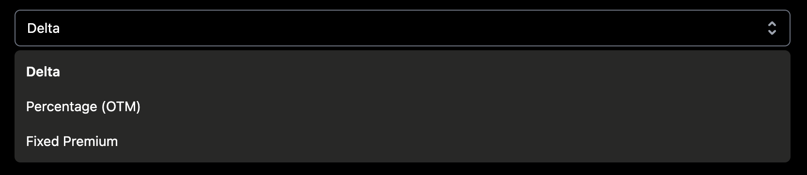

By default, the option legs will be based on delta
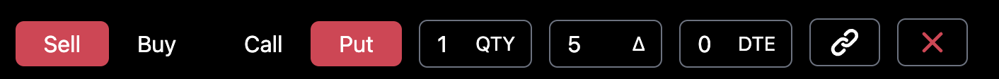
*Notice the delta symbol in the "type column" between the QTY and the DTE fields*.

You can also use Percentage OTM (Out of the Money)

*Notice the percentage symbol in the "type column" between the QTY and the DTE fields*.

You can also use Percentage OTM (Out of the Money)

*Notice the dollar symbol in the "type column" between the QTY and the DTE fields*.

### Option Legs

What is an option leg? At the end of the day, a leg is made up of type (put or call), direction (buy or sell), and days to expiration (DTE)

type (put or call)

direction (buy or sell)

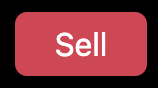

quantity (qty) of each leg

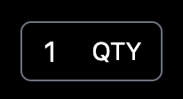

days to expiration (dte)

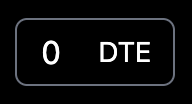

### Linked Legs

There are some strategies that require different things. For instance, when you are selling a put spread that is 10-wide, 
you will need to know what the short leg's strike is before you can buy a leg 10 points away. Another example would be if you are buying a calendar.
You will need to know what the short strike is for the front month before you can purchase the long strike for the back month.
To solve this, Option Omega uses the concept of "Linked Legs".

In order to link a leg, we will use this magical button here:

When you click that button you will see that the button highlights and a new leg drops down underneath.

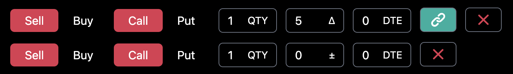

Notice on the bottom leg that the spot where your selection type goes looks different than the one above.

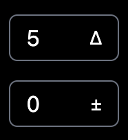

We default this to 0 for you. That means that as it currently stands, the bottom leg will be the same strike price as the top leg. 
This is useful for time spreads where you have different option legs with different days to expiration. For example, a common long calendar strategy:

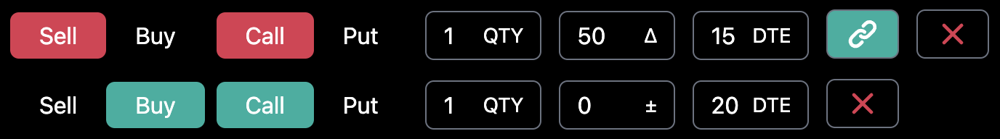

Let's say we wanted to sell a 25 delta put spread and we wanted the spread to be 10 points wide. How would we go about setting that up?

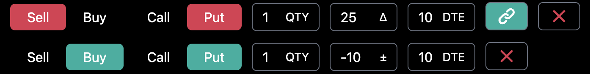

The top leg shows us selling a 25 delta put and the bottom leg has an offset of -10. It is important to remember that 
negative values in the offset mean down the option chain.

How about if we wanted to sell a 25 delta call spread and we wanted the spread to be 50 points wide. How would we go about setting that up?

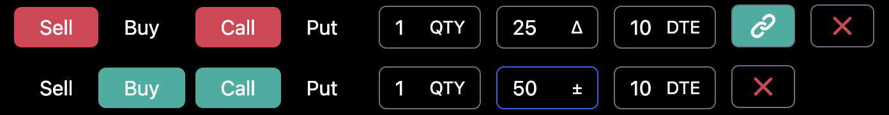

The top leg shows us selling a 25 delta call and the bottom leg has an offset of +50. It is important to remember that
positive values in the offset mean up the option chain.

## Entry Conditions
Entry conditions allow you to run a backtest only when certain conditions are met. 

### Entry Time

*please note: The available entry times are between 9:32am and 3:59pm EST*.

### Frequency

How often do you run your backtest is one of the most important questions you will need to think through when setting up your strategy. 

Before diving into the frequencies available to run your backtests, we need explain a very simple but very important toggle:

#### Use Exact DTE

This little button says that we want to run our strategy ONLY when there is an option contract that has our EXACT DTE. What does this mean? 

Let's look at a calendar strategy as an example.

If you have the "Use Exact DTE" button toggled, this test will only run IF there is BOTH a 15 DTE AND a 20 DTE available. Not 14 and 19. Not 16 and 21. ONLY a 15 DTE and a 20 DTE. 
Storing this knowledge in your heart will save you a ton of time in the long run. 

With that being said, let's move now to frequency types.

#### Daily

If you choose daily, Option Omega will run this strategy every day that you:
- Have the funds available to run it (more on this later)
- Have not exceeded the "max open trades" threshold that you set (more on this later)

#### Weekly 

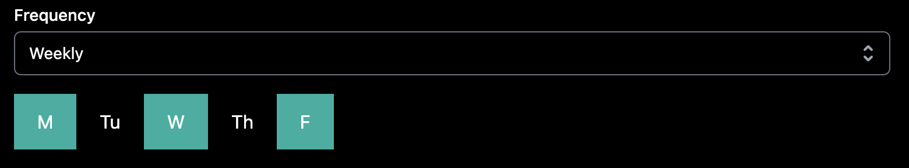

If you choose weekly, Option Omega will run this strategy every weekday (that you select) where you:
- Have the funds available to run it (more on this later)
- Have not exceeded the "max open trades" threshold that you set (more on this later)

#### Monthly

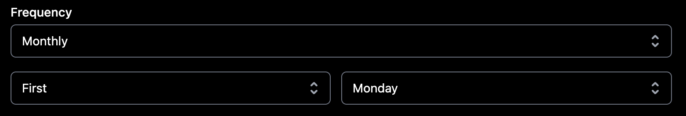

If you choose weekly, Option Omega will run this strategy every day of the month (that you select) where you:
- Have the funds available to run it (more on this later)
- Have not exceeded the "max open trades" threshold that you set (more on this later)

## Exit Conditions
> Stuff about strategies

## Misc
> Stuff about strategies