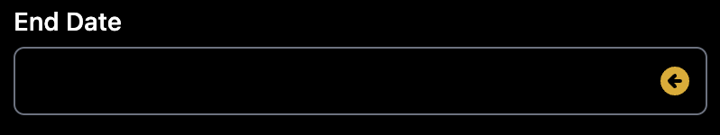
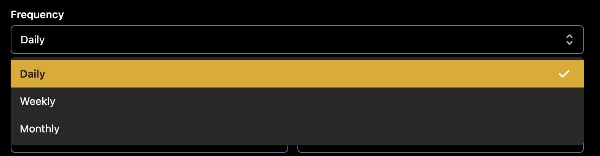
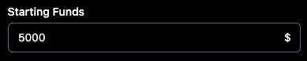
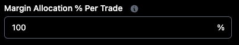
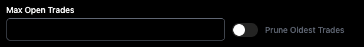
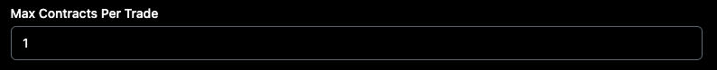

# Getting Started

## Running your first backtest
To create a new backtest, hit the "New Backtest" button on your dashboard

## Tickers
We offer backtesting in SPY, SPX, QQQ, and IWM

## Dates
You can test as far back as 1/1/13 and as most recent as yesterday.

We have some nice little bubbles with popular timeframes that will autopopulate for you

If you notice on the "End Date" field, we have a little arrow. That will populate the last available trading day

## Building your Strategy

Under the "Strategy" section, we have a list of common strategies that you can choose from if you don't want to create your own. Below is information about each one.

*Please note, all examples are from The Options Playbook and Tastytrade.*.

- [Butterfly](https://www.optionsplaybook.com/option-strategies/long-call-butterfly-spread/)
- [Calendar](https://www.optionsplaybook.com/option-strategies/calendar-call-spread/)
- [Double Calendar](https://www.tastytrade.com/news-insights/double-calendar-spread-mechanics)
- [Iron Condor](https://www.optionsplaybook.com/option-strategies/iron-condor/)
- [Iron Fly](https://www.optionsplaybook.com/option-strategies/iron-butterfly/)
- [Jade Lizard](https://www.tastytrade.com/concepts-strategies/jade-lizard)
- [Long Call](https://www.optionsplaybook.com/option-strategies/long-call/)
- [Long Call Spread](https://www.optionsplaybook.com/option-strategies/long-call-spread/)
- [Long Put](https://www.optionsplaybook.com/option-strategies/long-put/)
- [Long Put Spread](https://www.optionsplaybook.com/option-strategies/long-put-spread/)
- [Ratio Spread](https://www.tastytrade.com/concepts-strategies/ratio-spread)
- [Short Call](https://www.optionsplaybook.com/option-strategies/short-call/)
- [Short Call Spread](https://www.optionsplaybook.com/option-strategies/short-call-spread/)
- [Short Put](https://www.optionsplaybook.com/option-strategies/short-put/)
- [Short Straddle](https://www.optionsplaybook.com/option-strategies/short-straddle/)
- [Short Strangle](https://www.optionsplaybook.com/option-strategies/short-strangle/)

### Strike Selection Type

*Please note, you can only choose one selection for all legs in the trade*.

By default, the option legs will be based on delta

*Notice the delta symbol in the "type column" between the QTY and the DTE fields*.

You can also use Percentage OTM (Out of the Money)

*Notice the percentage symbol in the "type column" between the QTY and the DTE fields*.

You can also use Percentage OTM (Out of the Money)

*Notice the dollar symbol in the "type column" between the QTY and the DTE fields*.

### Option Legs

What is an option leg? At the end of the day, a leg is made up of type (put or call), direction (buy or sell), and days to expiration (DTE)

type (put or call)

direction (buy or sell)

quantity (qty) of each leg

days to expiration (dte)

### Linked Legs

There are some strategies that require different things. For instance, when you are selling a put spread that is 10-wide, 
you will need to know what the short leg's strike is before you can buy a leg 10 points away. Another example would be if you are buying a calendar.
You will need to know what the short strike is for the front month before you can purchase the long strike for the back month.
To solve this, Option Omega uses the concept of "Linked Legs".

In order to link a leg, we will use this magical button here:

When you click that button you will see that the button highlights and a new leg drops down underneath.

Notice on the bottom leg that the spot where your selection type goes looks different than the one above.

We default this to 0 for you. That means that as it currently stands, the bottom leg will be the same strike price as the top leg. 
This is useful for time spreads where you have different option legs with different days to expiration. For example, a common long calendar strategy:

Let's say we wanted to sell a 25 delta put spread and we wanted the spread to be 10 points wide. How would we go about setting that up?

The top leg shows us selling a 25 delta put and the bottom leg has an offset of -10. It is important to remember that 
negative values in the offset mean down the option chain.

How about if we wanted to sell a 25 delta call spread and we wanted the spread to be 50 points wide. How would we go about setting that up?

The top leg shows us selling a 25 delta call and the bottom leg has an offset of +50. It is important to remember that
positive values in the offset mean up the option chain.

## Entry Conditions
Entry conditions allow you to run a backtest only when certain conditions are met. 

### Entry Time

*please note: The available entry times are between 9:32am and 3:59pm EST*.

### Frequency

How often do you run your backtest is one of the most important questions you will need to think through when setting up your strategy. 

Before diving into the frequencies available to run your backtests, we need explain a very simple but very important toggle:

#### Use Exact DTE

This little button says that we want to run our strategy ONLY when there is an option contract that has our EXACT DTE. What does this mean? 

Let's look at a calendar strategy as an example.

If you have the "Use Exact DTE" button toggled, this test will only run IF there is BOTH a 15 DTE AND a 20 DTE available. Not 14 and 19. Not 16 and 21. ONLY a 15 DTE and a 20 DTE. 
Storing this knowledge in your heart will save you a ton of time in the long run. 

With that being said, let's move now to frequency types.

#### Daily

If you choose daily, Option Omega will run this strategy every day that you:
- Have the funds available to run it (more on this later)
- Have not exceeded the "max open trades" threshold that you set (more on this later)

#### Weekly 

If you choose weekly, Option Omega will run this strategy every weekday (that you select) where you:
- Have the funds available to run it (more on this later)
- Have not exceeded the "max open trades" threshold that you set (more on this later)

#### Monthly

If you choose weekly, Option Omega will run this strategy every day of the month (that you select) where you:
- Have the funds available to run it (more on this later)
- Have not exceeded the "max open trades" threshold that you set (more on this later)

### Starting Funds

This is the ammount of money you want to start the test with. It will obviously change as your p/l changes.

### Margin Allocation % Per Trade

This is the percentage of your starting funds that you want to use for each test. Let's think through a couple of examples. 

Let's say you want to sell a call credit spread 5 points out. Assuming you are starting with over 1k in funds, 
you should be able to run through a couple of trades in the test before you were ever in danger of running out of funds.

Now, let's say you wanted to sell a naked call with your starting funds at 1k. Would this run? No it would not. Why?
Because naked options require more margin than spreads.

Quite often, we get asked why the number of contracts per trade seem to increase or decrease through the life of the trade. 
The reason is that Option Omega is dynamically running your strategy using the starting funds and the margin allocation % that you put in place.
When in doubt, check these fields.

*please note: While we have made every effort to have accurate and realistic margin modeling, margin requirements vary between brokerages, and not all trades are supported.*.

### Max Open Trades

This is the amount of trades you want to have on at any one time through the life of the test. 

Let's say you are selling a put credit spread 120 days out and you are doing it everyday that you have the capital available to place the trade.
If you start with a million dollars and you are allocating 2% of your margin allocation, you theoretically could have hundreds of trades on your book.
This option allows you to put in place a limit on how many trades you can have on at any given time. With this you are basically saying that no matter
how much money and how high an allocation I am using, never have open more than x-number of trades at any given time.

You may notice that little toggle to the right that says, "Prune Oldest Trades". If you want to have x-number of trades on but you want to continue the 
strategy, you can toggle this on. What it will do is close the oldest trade on your books before opening a new one.

### Max Contracts Per Trade

If you would like to bypass all of the allocation work that is done through Option Omega, than you can simply put 1 in this field. That way, we will 
ever only use one contract per trade, no matter how much your allocation % is or what your starting funds are.

Another scenario where this comes in handy is if your strategy is hugely successfull over time! Let's imagine a strategy that won 99.9% of the time 
while suffering only a 1% drawdown (If you find this please email us immediately!). If you are starting with 10k in funds and allocating 100% to this strategy,
you would quickly be putting on thousands of contracts at one time. To be more realistic, you might want to limit the number of contracts 
to a reasonable representation of what you think you could get filled on.

### Use Vix

You can set a minimum or maximum VIX level as an entry condition. For instance, you are buying a double calendar but you only want to do it in environments 
where the VIX is under 20. Another example would be you are selling a put credit spread but you only want to enter if the VIX is over 40.

### Use Technical Indicators

*RSI and SMA are calculated at 1 minute intervals.*
*RSI is calculated using 14-day length and simple smoothing.*

#### Min/Max RSI

The Relative Strength Index (RSI), developed by J. Welles Wilder, is a momentum oscillator that measures the speed and change of price movements. 
The RSI oscillates between zero and 100. Traditionally the RSI is considered overbought when above 70 and oversold when below 30.

#### SMA
Simple moving averages calculate the average of a range of prices by the number of periods within that range.

### Use Gaps

*Please note: Use positive numbers for all values.*

Trade when the market moves a certain percentage from the previous close to current open.

### Use SqueezeMetrics™ (Gamma / Dark Pool) Indicators

SqueezeMetrics provides open access to end-of-day DIX, GEX, and GXV values. Please see [SqueezeMetrics](https://squeezemetrics.com/) for more information.

#### Min DIX/Max DIX
Dark Index (percentage). "Relative amount of trade volume marked 'short' in off-exchange (dark) trading."

#### Min GEX/Max GEX
Market Makers' Gamma Exposure (billions $)

#### Min GEX/Max GXV
Gamma Volatility; "1-day volatility historically associated with the given level of GEX"

*Please note: A historical low of GXV would be around a 6. A historical high GXV would be above 30 *

## Exit Conditions
> Stuff about strategies

## Misc
> Stuff about strategies